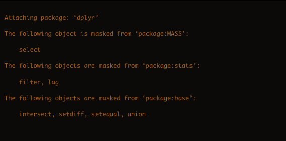
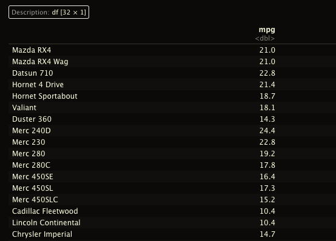
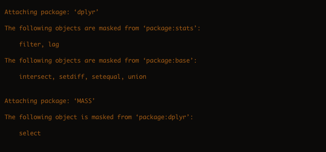
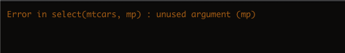

```{r xaringan-themer, include=FALSE, warning=FALSE}
# xaringan::summon_remark()
library("xaringanthemer")
style_duo_accent(
  primary_color = "#03A696",
  secondary_color = "#035AA6",
  header_font_google = google_font("Josefin Sans"),
  text_font_google   = google_font("Montserrat", "300", "300i"),
  code_font_google   = google_font("Fira Mono"),
  inverse_text_shadow = FALSE,
  outfile = "css/xaringan-themer.css")
```

```{r xaringanExtra, include=FALSE}
xaringanExtra::use_xaringan_extra(c("tile_view", "scribble"))
xaringanExtra::use_fit_screen()
xaringanExtra::use_panelset()
xaringanExtra::use_tachyons()
xaringanExtra::use_share_again()
```

```{r load_pkgs, include=FALSE}
library("ggplot2")

library("tidymodels")
library("rsample")
library("recipes")

library("dplyr")
library("tibble")
library("magrittr")
library("data.table")
```

layout: false

name: title
class: left, bottom
background-image: url("figuras/title-slide.001.jpeg")
background-size: contain

.pull-left[

# .midlarge[.black[`r rmarkdown::metadata$title`]]

## .mid[.black[`r rmarkdown::metadata$subtitle`]]

#### .large[.black[`r rmarkdown::metadata$author` | `r rmarkdown::metadata$date`]]

]

<div class="cr cr-top cr-left cr-sticky cr-black">COVID19</div>

---

```{r, include=FALSE, eval=TRUE}
library("metathis")
meta() %>%
  meta_general(
    description = "Oficina para aprendizagem prática em ambiente R de ferramentas para manipular, pré-processar e analisar dados de espectroscopia no infravermelho próximo (NIR).",
    generator = "xaringan e remark.js"
  ) %>% 
  meta_name("github-repo" = "ricoperdiz/oficina-dados-nir") %>% 
  meta_social(
    title = "Oficina de análise de dados NIR em ambiente R - Partes 1—3 - Manejo de dados com *dplyr*, preparação de dados, e PCA",
    url = "https://oficina-dados-nir-dia01.netlify.app",
    image = "https://raw.githubusercontent.com/ricoperdiz/oficina-dados-nir/main/01_dia1/share-card.png",
    image_alt = paste(
      "Slide título da oficina Análise de dados NIR em ambiente R:",
      "Manejo de dados com *dplyr*, preparação de dados, e PCA,",
      "apresentado de forma privada a um grupo de estudantes no dia 30 de junho de 2021."
      ),
    og_type = "website",
    og_author = "Ricardo de Oliveira Perdiz",
    twitter_card_type = "summary_large_image",
    twitter_creator = "@ricoperdiz"
  )
```

class: middle, center, hide_logo
background-image: url("figuras/who-am-i.001.jpeg")
background-size: cover


.pull-left[

### Sobre mim


  **Dr. em Botânica (INPA)**  
  **Analista de dados**  
  
  [`r icons::fontawesome("github")` @ricoperdiz](https://github.com/ricoperdiz)  
  [`r icons::fontawesome("twitter")` @ricoperdiz](https://twitter.com/ricoperdiz)  
  [`r icons::fontawesome("link")` ricardoperdiz.com](https://ricardoperdiz.com)  
  [`r icons::fontawesome("paper-plane")` ricoperdiz@gmail.com](mailto:ricoperdiz@gmail.com)  

]

<div class="cr cr-top cr-left cr-sticky cr-black">COVID19</div>

---

layout: true

<div class="cr cr-top cr-left cr-sticky cr-black">COVID19</div>

<a class="footer-link" href="https://github.com/ricoperdiz/oficina-dados-nir">Análise de dados NIR em R</a>

---

# Sumário


### Uma breve [introdução](#intro)

--

### Manipulação de dados com o pacote [dplyr](#dplyr)

--

### [Preparação dos dados](#prep-dados) para análise

--

### Análise de componentes principais [(PCA)](#pca)

---
name: intro
# "There should be one – and preferably only one – obvious way to do it." (The Zen of Python)<sup>1</sup>

--

#### *Paradigma em linguagens de programação.*  

--

## "There’s more than one way to do it" (**Perl**, **R**)


.footnote2[
1: [The Zen of Python](https://zen-of-python.info/beautiful-is-better-than-ugly.html)
]


---

# Há mais de uma maneira de se fazer uma determinada ação no R

```{r, eval = FALSE}
plot(mtcars$hp, mtcars$mpg)


plot(mpg ~ hp, data = mtcars)

library(lattice)
xyplot(mpg ~ hp, data = mtcars)

library(ggplot2)
ggplot(mtcars, aes(x = hp, y = mpg)) + geom_point()
```

???

Várias maneiras de se fazer algo em R, todas com vantagens e desvantagens.
O guia de desenvolvedor do Python afirma:
R é muito diferente de Python nesse aspecto. Uma vantagem da diversidade de interfaces do R é que ela pode se desenvolver com o tempo e se ajustar às diferentes necessidades dos usuários.

---
class:center, inverse, middle

# Por que ensinar ferramentas do *tidyverse*, *caret* e *tidymodels*?

--

### Enraizar a idéia de ter *UM* conjunto de ferramentas para trabalhar e analisar os dados

---

# Instruções gerais

```{r, eval=FALSE}
data.frame(a = 1:10, b = 1:10)
```

--

### Um código por linha!

```{r, eval=FALSE}
data.frame(
  a = 1:10,
  b = 1:10)
```

---

# Instruções gerais

### Dúvidas?

--

### Dúvidas de R básico, eu vou apontar onde descobrir a solução, mas não vou focar em resolver nesta oficina.

--

### Podem parar e perguntar!


---

# Dados para a oficina

--

### 1. Conjunto de dados `nir_data`<sup>1</sup>, que acompanha o pacote `NIRtools`<sup>2</sup>.  
--

### 2. Próprios dados


.footnote2[
1. Perdiz (2020) Delimitação específica e filogeografia do complexo *Protium aracouchini* (Aubl.) Marchand (Burseraceae). Tese de doutorado. Programa de pós-graduação em Ciências Biológicas, INPA, Manaus, Amazonas, Brasil. <https://repositorio.inpa.gov.br/handle/1/36948>  

2. Perdiz (2021) <https://github.com/ricoperdiz/NIRtools>  

]

???

Vou utilizar o conjunto de dados `nir_data`, um subconjunto proveniente de minha tese de doutorado (Perdiz 2020), e que acompanha o pacote `NIRtools` (Perdiz 2021) para servir como exemplo para as análises neste tutorial.
Vale ressaltar que esse conjunto de dados é **extremamente pequeno**, por isso desconsidere os resultados das análises.
Ele servirá apenas de guia para abordar os procedimentos aqui abordados.  

---
name: dados
## Importação dos dados `nir_data`<sup>1</sup>

Para ler o conjunto de dados que utilizarei nesta oficina, basta rodar o comando abaixo:

```{r, eval=FALSE}
dados <-
  read.table("https://raw.githubusercontent.com/ricoperdiz/NIRtools/master/inst/extdata/nir_data.csv", sep = "\t", header = TRUE, as.is = TRUE)
```

.footnote2[

1. Perdiz (2020) <https://repositorio.inpa.gov.br/handle/1/36948>  

]

--

De maneira alternativa, você pode ler estes dados utilizando a função `fread()` do pacote `data.table`:

```{r, eval=FALSE}
library("data.table")
dados <-
  fread("https://raw.githubusercontent.com/ricoperdiz/NIRtools/master/inst/extdata/nir_data.csv")
```

```{r, include=FALSE}
dados <- fread("nir_data.csv") %>% as_tibble(.)
```

---

## Importação de dados próprios

De maneira alternativa, como no exemplo anterior, você pode utilizar a função `fread()` do pacote `data.table`. Esta função não exige a especificação do separador, pois é automaticamente descoberto:

```{r, eval=FALSE}
library("data.table")
dados <- fread("MEUSDADOS.csv")
```

---

## Transformação do `data.frame` em um `tibble`<sup>1</sup>

```{r}
library("tibble")
dados <- as_tibble(dados)
head(dados)
```

.footnote2[

1. Este passo **NÃO É NECESSÁRIO**. Ele facilita apenas a visualização dos dados no console, e indica o tipo de cada variável em seu conjunto de dados. Saiba mais sobre um `tibble` em [https://r4ds.had.co.nz/tibbles.html](https://r4ds.had.co.nz/tibbles.html).  

]

---


## Checagem básica

Primeiras 10 linhas e 5 colunas

```{r, eval = TRUE, cache = TRUE}
dados[1:10, 1:5]
```

---

## Estrutura dos dados

```{r}
str(dados[, 1:15])
```

---

## Contagem de número de amostras por determinada categoria

`SP1` é a variável que contem nome de espécie em meu conjunto de dados: 

```{r}
table(dados$SP1)
```


---

.pull-left[
## Plot - `NIRtools`<sup>1</sup>

Função `nirdf()`<sup>2,3</sup> converte um objeto com dados NIR em um objeto de classe `nirdf`, o que permite então utilizar u método próprio para plotar em R usando a função `plot()`.  

```{r, message=FALSE}
nirdad <-
  NIRtools::nirdf(
    dados,
    category = "SP1",
    measure_columns = grep("^X", names(dados), value = TRUE),
    measure_columns_prefix = "X"
  )
```
]

.pull-right[
```{r, fig.width=12, fig.height=10, cache=TRUE}
plot(nirdad, "SP1",
     cex_pt = .7,
     cex_leg = 2,
     text_font = 3)
```
]

.footnote2[
1. Perdiz (2021). <https://github.com/ricoperdiz/NIRtools>.  
2. Ver tutorial em <https://github.com/ricoperdiz/NIRtools> para aprender a usar a função `nirdad`.  

3. Outra alternativa é utilizar os passos contidos em <http://botanicaamazonica.wiki.br/labotam/doku.php?id=analises:nir:ver_spectra>, de autoria do [Dr. Alberto Vicentini (INPA)](http://botanicaamazonica.wiki.br/labotam/doku.php?id=alunos:a.vicentini:inicio).  
]

---
name: dplyr
class: inverse, center, middle

# Manipulação de dados com o pacote *dplyr*

---
class: middle

.pull-left[
# O que é o dplyr?


]

--

.pull-right[

### Funções ou **verbos** para manipular e sumarizar dados tabulados.  

### **Não** é um pacote de **ações rápidas**.  

### Nomes de funções facilitam a memorização.  

### Nomes sem aspas dentro das funções!

]

???

Este pacote possui uma série de funções/**verbos** para manipular e sumarizar dados tabulados.  
Não é o pacote mais rápido ou eficiente para fazer tais ações.  
Porém, o uso de funções cujos nomes nos remetem às ações que efetuamos rotineiramente com dados facilita a memorização.  
Somado a isso, não temos a necessidade de usar aspas nos nomes das variáveis, o que acelera a digitação.  

---

## Principais funções do pacote `dplyr`

* Seleção de colunas - `select()`

--

* Ordenar linhas - `arrange()`

--

* Filtrar linhas - `filter()`

--

* Criar novas colunas - `mutate()`

--

* Sumarizar resultados - `summarise()`

--

* Função especial para agrupamentos - `group_by()`

---

## Carregando o pacote

```{r}
library("dplyr")
```

---

## Atenção na hora de carregar os pacotes

--

### Ordem de carregar pacotes é IMPORTANTE!


```{r, eval=FALSE, echo=TRUE}
library("MASS")
library("dplyr")
```



---

### `select()` do dplyr funciona!

```{r, eval=FALSE, echo=TRUE}
select(mtcars, mpg)
```



---

### Conflito com funções de mesmo nome!

```{r eval=FALSE}
library("dplyr")
library("MASS")
```



---

### Erro em `select()` do dplyr!

```{r, eval=FALSE}
select(mtcars, mpg)
```



---

## Selecionando colunas com `select()`

**Podemos selecionar quantas colunas desejarmos.**  

--

### Uma coluna

```{r}
select(dados, especimenid)
```

???

Para selecionar uma coluna, usamos a função select().
O primeiro argumento é o nome do data.frame, `dados`; a partir do segundo argumento, colocamos os nomes das colunas sem aspas.

---

## Selecionando colunas com `select()`

### *Duas* colunas

```{r}
select(dados, especimenid, SP1)
```

---

## Selecionando colunas com `select()`

### *Múltiplas* colunas

```{r}
select(dados, especimenid, SP1, coletor, number)
```

---

## Remoção de colunas

### Uma coluna

```{r}
dados_1colunaremovida <- select(dados, -especimenid)
head(dados_1colunaremovida)
```


---

## Remoção de colunas

### Duas colunas

```{r}
dados_2colunasremovidas <- select(dados, -especimenid, -SP1)
head(dados_2colunasremovidas)
```


---

## Remoção de colunas

### Múltiplas colunas

```{r}
multiplas_colunas_removidas <- select(dados, -one_of(c("especimenid", "SP1", "face")))
head(multiplas_colunas_removidas)
```

---

## Reordenar colunas

```{r}
select(dados, SP1, number, coletor)
```

---

## Reordenar colunas com `everything()`

```{r}
select(dados, coletor, number, everything())
```

---

## Funções auxiliares de `select()`

Há verbos que auxiliam a busca das colunas desejadas.
São eles:  

--

* `starts_with()`: Coluna começa com um prefixo X;
* `ends_with()`: Termina com um sufixo X;
* `contains()`: Contem uma determinada palavra;
* `matches()`: Busca uma expressão regular (veja `?regex`);
* `num_range()`: Busca uma amplitude numérica.

---

## `starts_with()`

```{r}
select(dados, starts_with("col"))
```

---

## `ends_with()`

```{r}
select(dados, ends_with("r"))
```

---

## `contains()`

```{r}
select(dados, contains("ol"))
```

---

## `matches()`

```{r}
select(dados, matches("^X[0-9]+\\.97$"))
```

---

## `num_range()`

```{r}
select(dados, num_range("X", seq(from = 3999.64, to = 4007.354, by = 3.857)))
```

---

## Combinações de linhas distintas - `distinct()`

Ao selecionar diversas colunas, podemos querer ver combinações distintas de linhas.  

--

Usamos então a função `distinct()` para obter essas combinações:

```{r}
distinct(dados, coletor, number, SP1)
```

---

## Ordenar linhas - `arrange()`

```{r}
arrange(dados, number)
```

---

## Ordenar linhas - `arrange()`

```{r}
arrange(dados, desc(number))
```

---

## Filtragem de linhas - `filter()`

```{r}
filter(dados, SP1 == "P. calanense")
```

---

## Filtragem composta

```{r}
filter(dados, SP1 == "P. calanense", number == 3237)
```

---
class: inverse, center

## Filtragem composta

### > filter(dados, SP1 == "P. calanense", number == 3237)

--

## É o mesmo que

--

### > filter(dados, SP1 == "P. calanense" & number == 3237)

--

## .bg-green[Vírgula `,` em `filter()` equivale a `&`]

---

## Criar novas colunas - `mutate()`

```{r}
nova_coluna <- mutate(dados, calanense = ifelse(SP1 == "P. calanense", 1, 0))
select(nova_coluna, SP1, calanense)
```

---

## Sumarizar resultados - `summarise()`

```{r}
summarise(dados, media_X8438.97 = mean(X8438.97))
```

???

A função `summarise()` colapsa um `data.frame` em uma única linha.
No entanto, a verdadeira utilidade dessa função se manifesta ao utilizarmos a função `group_by` para destacar os agrupamentos que desejamos fazer dentro dos dados.

---

## Agrupamentos - `group_by`

```{r}
dados_agrupados <- group_by(dados, SP1)
dados_agrupados[1:5, 1:10]
```

--

Os dados estão agrupados?

```{r}
is_grouped_df(dados_agrupados)
```

???

Suponhemos que eu queira ver médias de determinada variável para as espécies de meu conjunto de dados.
Usamos a função `group_by` para agrupar os dados em torno da variável `SP1`.
À primeira vista, não há resultado aparente.  


Porém, ao usarmos essa função `is_grouped_df()`, temos a certeza de que os dados estão agrupados.
Não se preocupem em aprender essa função.
Foquem na lição a seguir.  

---

## Agrupa e sumariza!

```{r}
summarise(dados_agrupados, media_X8438.97 = mean(X8438.97))
```

???

Vamos sumarizar os dados para a variável `X8438.97`.

---

## Sumarizar várias colunas

```{r}
dados_agrupados2 <- 
  group_by(
  select(dados, SP1, ends_with("7")),
  SP1
  )
summarise_all(dados_agrupados2, .funs = mean)
```

---

## Combinando operações com o *pipe* (cano!)

--

### Ferramenta existente em outras linguagens (*bash*, *F#*).  

--

### Simplifica códigos.  

--

### Facilita a leitura.  

--

### Reduz a quantidade de objetos na área de trabalho `ls()`.  

--

### Duas opções:

* `%>%` (pacote *magrittr*)
* `|>` (a partir do R 4.1).

---

## Código sem encadeamento


```{r}
summarise_all(group_by(filter(select(dados, SP1, ends_with("7")), SP1 == "P. calanense"), SP1), .funs = mean)
```

---

## Possível solução - criação de objetos intermediários


```{r}
dados_selecionados <- select(dados, SP1, ends_with("7"))
dados_filtrados <- filter(dados_selecionados, SP1 == "P. calanense")
dados_agrupados3 <- group_by(dados_filtrados, SP1)
summarise_all(dados_agrupados3, .funs = mean)
```

???

Porém, a criação de objetos intermediários "suja" a área de trabalho com objetos que, muitas vezes, não chegarão a serem utilizados novamente

---

## Vamos encadear com `%>%`

```{r}
select(dados, SP1, ends_with("7")) %>% 
  filter(., SP1 == "P. calanense") %>% 
  group_by(., SP1) %>% 
  summarise_all(., .funs = mean)
```

---

## Aplicações de agrupamentos em dados NIR

--

Suponha que você deseja obter valores de média de cada variável NIR por indivíduo.

--

No [conjunto de dados exemplo desta oficina](#dados), `dados`, indivíduos são reconhecidos pela variável `especimenid`.  

--

Logo, esta variável, `especimenid`, será nosso agrupamento.  

---
name: media-individuo
### Média por indivíduo

#### Sem encadeamento (sem uso do operador `%>%`)

```{r}
summarise_all(
    group_by(select(dados, especimenid, SP1, starts_with("X")), especimenid, SP1),
    .funs = mean)
```

---

### Média por indivíduo

#### Com encadeamento, utilizando o operador `%>%`

Mesmo cálculo do [slide anterior](#media-individuo)

```{r}
dados %>% 
  select(., especimenid, SP1, starts_with("X")) %>% 
  group_by(., especimenid, SP1) %>% 
  summarise_all(., .funs = mean)
```

---
name: media-individuo-face
### Média por indíviduo + face do folíolo

#### Sem encadeamento (sem uso do operador `%>%`)

```{r}
summarise_all(
    group_by(select(dados, especimenid, SP1, face, starts_with("X")), especimenid, SP1, face),
    .funs = mean)
```

---

### Média por indíviduo + face do folíolo

#### Com encadeamento, utilizando o operador `%>%`

Mesmo cálculo do [slide anterior](#media-individuo-face)

```{r}
dados %>% 
  select(., especimenid, SP1, face, starts_with("X")) %>% 
  group_by(., especimenid, SP1, face) %>% 
  summarise_all(., .funs = mean)
```

---
class: inverse, center, middle

# Pausa para o café e PERGUNTAS

.center[

]

.footnote[

Fonte do gif: .bg-white[<https://escolaconquer.com.br/blog/wp-content/uploads/2018/07/café.gif>]  

]


---
name: prep-dados
class: inverse, center, middle

# Preparação dos dados para análise

---


## Pré-análise

--

#### Divisão de dados em conjuntos `treino` e `teste`

--

#### Criação de *receitas* de dados para pré-processamento dos dados

---
class: inverse, center, middle

## Divisão de dados em conjuntos _treino_ e _teste_


???

Vamos utilizar aqui as funcionalidades dos pacotes dentro da interface `tidymodels` (Kuhn et al. 2020).

---

### `rsample::initial_split()` (Silge et al. 2021) 
--

```{r}
library("rsample") # initial_split
```

```{r}
dados_split <- initial_split(dados, prop = 3/4)
dados_split
```

???

rsample::initial_split(), que é carregado automaticamente ao se chamar o pacote `tidymodels` - esta função cria índices para separar o conjunto de dados em `treino` e `teste`. Por padrão, a função divide o conjunto de dados em 75% para `treino` e 25% para `teste`. Caso você queira outra proporção, altere o argumento `prop`. Em caso de dúvida, veja o `?` desta função executando o comando `?initial_split`.

---

#### Divisão de dados proporcionalmente em relação a uma variável

--

```{r}
dados_split <- initial_split(dados, prop = 3/4, strata = "SP1")
```


---

#### Conjunto _treino `rsample::training()`_ vs. _teste `rsample::testing()`_

--

##### Conjunto *treino*

```{r}
treino <- training(dados_split)
table(treino$SP1)
```

???

ambas do mesmo pacote `rsample` - ambas recebem o objeto criado com a função `initial_split()`, `dados_split`, e dividem o treino em conjuntos `treino` e `teste`, respectivamente:

---


#### Conjunto _treino `rsample::training()`_ vs. _teste `rsample::testing()`_

##### Conjunto *teste*

```{r}
teste <- testing(dados_split)
table(teste$SP1)
```

---

#### Reprodutibilidade na aleatorização

`set.seed()`

--

```{r}
set.seed(221015)
iris_split <- initial_split(iris, prop = 3/4, strata = "Species")
iris_split
```


???

Vamos estabelecer uma `seed` para que vocês cheguem ao mesmo resultado, caso utilizem estas "receitas" durante o aprendizado do tutorial.  

Recomendo que vocês executem esses comandos juntamente comigo para que vocês tenham ciência de que a quebra dos dados será igual para todos.  

---

#### Reprodutibilidade na aleatorização

```{r}
head(training(iris_split), 20)
```

---
class: inverse, center, middle

## Criação de *receitas* de dados para pré-processamento dos dados

---

### Ambiente de pré-processamento do pacote `recipes` (Kuhn e Wickham 2021).

--

* Seleção de variáveis

--

* Remoção de valores ausentes

--

* Transformar valores

--

* etc (ver <https://www.tmwr.org/recipes.html#skip-equals-true>)

---

### Como funciona?

```
recipes::recipe(FORMULA, data = NomeDoDataFrame)
```

???

Ele facilita a criação de "receitas" que permitem a criação e documentação de conjuntos de dados para serem utilizados posteriormente em análises do `tidymodels`, permitindo ao usuário um fluxo contínuo de análise de dados e a facilidade na reutilização do mesmo conjunto de dados para diversas análises.
Recomendo o aprendizado destas novas (algumas não tão novas, como é o caso do pacote `caret` ferramentas de pré-processamento e análise de dados em R.  


A primeira função desta abordagem é a função `recipe()`, em que usamos uma fórmula `SP1 ~ .` para dizer que `SP1` é nossa variável resposta e as demais são as variáveis preditoras, representadas pelo `.` na fórmula.
Porém, sabemos que nosso conjunto de dados `dados` possui outras variáveis que não são preditoras, como `face` e `coletor`.  

---

### Uso básico

```{r}
library("recipes")
```

--

```{r, eval=TRUE}
recipes::recipe(SP1 ~ ., data = dados)
```

???

Aí entra o papel da função `update_role()` em que informamos o papel de cada variável extra em nosso conjunto de dados.
Por exemplo, as variáveis `coletor`e `number` são identificadores da coleta.
Então, iniciamos a função com o objeto contendo a receita, `dados_receita`, e colocamos estas duas variáveis, sem aspas, em seguida, seguido do argumento `new_role`, em que colocamos um texto informando que papel é esse.
Ao utilizarmos esta receita nos passos de análises, essas variáveis não serão analisadas pois terão a informação desses `papéis` que elas têm no conjunto de dados.

---

#### Atualizando o papel de variáveis extras

--

#### Dados do espécime

```{r}
recipes::recipe(SP1 ~ ., data = dados) %>% 
  update_role(., coletor, number, new_role = "dados do espécime") #<<
```

---

#### Face do folíolo

```{r}
recipes::recipe(SP1 ~ ., data = dados) %>% 
  update_role(., coletor, number, new_role = "dados do espécime") %>% 
  update_role(., face, new_role = "identificador da face do foliolo") #<<
```

---

#### Identificador do espécime

```{r}
recipes::recipe(SP1 ~ ., data = treino) %>% 
  update_role(., coletor, number, new_role = "dados do espécime") %>% 
  update_role(., face, new_role = "identificador da face do foliolo") %>% 
  update_role(., especimenid, new_role = "id") #<<
```


---

#### Receita completa

```{r}
dados_receita <- 
  recipes::recipe(SP1 ~ ., data = treino) %>% 
  update_role(., especimenid, new_role = "id") %>% 
  update_role(., coletor, number, new_role = "dados do espécime") %>% 
  update_role(., face, new_role = "identificador da face do foliolo")
dados_receita
```

---

#### Preparo da receita com `prep()`

```{r}
dados_receita_prep <- prep(dados_receita) #<<
dados_receita_prep
```

---

#### *Assando* o conjunto `teste` pós-receita

> `bake()`

--

```{r}
teste_processado <- bake(dados_receita_prep, new_data = teste) #<<
teste_processado
```

---

#### *Espremendo* os dados `treino`

> `juice()`

--

```{r}
juice(dados_receita_prep) #<<
```

---

#### Receitas em etapas? Também pode!

```{r, eval=FALSE}
# receita para analise
dados_receita <- recipes::recipe(SP1 ~ ., data = treino)
dados_receita <- update_role(dados_receita, especimenid, new_role = "id")
dados_receita <- update_role(dados_receita, coletor, number, new_role = "dados do espécime")
dados_receita <- update_role(dados_receita, face, new_role = "identificador da face do foliolo")
dados_receita_prep <- prep(dados_receita)
dados_receita_prep
```

--

#### [Base R vs. Tidyverse](https://intror.netlify.app/base-tidyverse.html#o-operador-e-o-encadeamento-de-a%C3%A7%C3%B5es) de nosso [Curso básico de Introdução ao R](https://intror.netlify.app/) para entender o encadeamento (*pipeline*) do `%>%`

???

Vejam que os comandos acima ficaram muito repetitivos, pois a receita `dados_receita` aparece múltiplas vezes.
Caso utilizássemos o encadeamento de ações proporcionado pelo operador `%>%` do pacote `magrittr` (Bache e Wickham 2020), o texto ficaria mais limpo.
Porém, devo admitir que isto é uma questão de preferência.  

---

#### Pré-processamento em `recipes`

Funções `step_*()`

---

##### Normalizar variáveis numéricas

```{r}
dados_receita_normal <- 
  dados_receita %>% 
  step_normalize(all_predictors()) #<<
dados_receita_normal
```

---
class: center, middle

#### Há várias possibilidades de transformação de dados com as funções `step_*()`

--

#### <https://recipes.tidymodels.org/reference/index.html>


---
class: inverse, center, middle

# Pausa para o café e PERGUNTAS

.center[

]

.footnote[

Fonte do gif: .bg-white[<https://escolaconquer.com.br/blog/wp-content/uploads/2018/07/café.gif>]  

]

---
name: pca
class: inverse, center, middle

# Análise de componentes principais (PCA)

---

class: center, middle

> PCA é um algoritmo matemático que reduz as dimensões dos dados ao mesmo tempo em que mantem a maior parte da variação do conjunto de dados. Ele cumpre essa redução ao identificar direções, chamadas de componentes principais, ao longo das quais a variação dos dados é máxima. Ao utilizar menos componentes, cada amostra pode ser representada por poucas variáveis em oposição à enormidade de variáveis presentes no conjunto de dados brutos. Amostras podem então ser plotadas, permitindo a inferência visual de similaridades e diferenças entre as amostras, e também determinar se as amostras podem ou não ser agrupadas<sup>1</sup>.

.footnote2[
1. Ringnér (2008). <https://doi.org/10.1038/nbt0308-303>.  
]

---

## PCA dentro da **receita**

```{r}
dados_receita_pca <- 
  dados_receita %>% 
  step_pca(all_predictors())
dados_receita_pca
```

---

## Preparando a PCA

```{r}
dados_receita_pca_prep <- 
  dados_receita_pca %>% 
  prep()
dados_receita_pca_prep
```

---

### Explorando o resultado com `tidy()`

```{r}
pca_tabela <- tidy(dados_receita_pca_prep, 1)
pca_tabela
```

---

### Calculando a variação das PC's

.pull-left[
```{r, eval=TRUE,echo=FALSE}
sdev <- dados_receita_pca_prep$steps[[1]]$res$sdev
percent_variation <- sdev^2 / sum(sdev^2)
pca_variacao <- 
  data.frame(
    pcs = unique(pca_tabela$component),
    variacao_porcentagem = percent_variation*100,
    variacao_cumulativa = cumsum(percent_variation*100)
  )
pca_variacao
```
]

.pull-right[

```{r, eval=FALSE,echo=TRUE}
sdev <- dados_receita_pca_prep$steps[[1]]$res$sdev
percent_variation <- sdev^2 / sum(sdev^2)
pca_variacao <- 
  data.frame(
    pcs = unique(pca_tabela$component),
    variacao_porcentagem = percent_variation*100,
    variacao_cumulativa = cumsum(percent_variation*100)
  )
pca_variacao
```

]

---

### Visualizando a PCA com `ggplot2`

.pull-left[
```{r, eval=TRUE,echo=FALSE,cache=TRUE}
library("ggplot2")
pc1 <- filter(pca_variacao, pcs == "PC1")
pc2 <- filter(pca_variacao, pcs == "PC2")
juice(dados_receita_pca_prep) %>%
  ggplot(aes(PC1, PC2)) +
  geom_point(aes(color = SP1), alpha = 0.7, size = 2) +
  xlab(paste0("PC1 (", round(pc1$variacao_porcentagem, 2), "%)")) +
  ylab(paste0("PC2 (", round(pc2$variacao_porcentagem, 2), "%)"))
```
]


.pull-right[
```{r, eval=FALSE,echo=TRUE}
pc1 <- filter(pca_variacao, pcs == "PC1")
pc2 <- filter(pca_variacao, pcs == "PC2")
juice(dados_receita_pca_prep) %>%
  ggplot(aes(PC1, PC2)) +
  geom_point(aes(color = SP1), alpha = 0.7, size = 2) +
  xlab(paste0("PC1 (", round(pc1$variacao_porcentagem, 2), "%)")) +
  ylab(paste0("PC2 (", round(pc2$variacao_porcentagem, 2), "%)"))
```
]

---

## Combinando etapas para a PCA

```{r}
dados_receita_normal_pca <- 
  dados_receita_normal %>% 
  step_pca(all_predictors()) %>% 
  prep()
dados_receita_normal_pca
```

---

### Checando as etapas da PCA com dados normalizados

#### Dados normalizados

```{r}
tidy(dados_receita_normal_pca, 1)
```

---

#### Checando médias das variáveis

```{r}
tidy(dados_receita_normal_pca, 1) %>%
  filter(statistic == "mean")
```

---

#### Checando desvio padrão das variáveis

```{r}
tidy(dados_receita_normal_pca, 1) %>%
  filter(statistic == "sd")
```

---

#### Checando a PCA normalizada

```{r}
pca_tabela_normalizada <- tidy(dados_receita_normal_pca, 2)
pca_tabela_normalizada
```


---

### Calculando a variação das PC's

.pull-left[
```{r, eval=TRUE,echo=FALSE}
sdev_pca_normalizada <- dados_receita_normal_pca$steps[[2]]$res$sdev
porcent_variacao_normalizada <- sdev_pca_normalizada^2 / sum(sdev_pca_normalizada^2)
pca_normalizada_variacao <- 
  data.frame(
    pcs = unique(pca_tabela_normalizada$component),
    variacao_porcentagem = porcent_variacao_normalizada*100,
    variacao_cumulativa = cumsum(porcent_variacao_normalizada*100)
  )
pca_normalizada_variacao
```
]

.pull-right[

```{r, echo=TRUE, eval=FALSE}
sdev_pca_normalizada <- dados_receita_normal_pca$steps[[2]]$res$sdev
porcent_variacao_normalizada <- sdev_pca_normalizada^2 / sum(sdev_pca_normalizada^2)
pca_normalizada_variacao <- 
  data.frame(
    pcs = unique(pca_tabela_normalizada$component),
    variacao_porcentagem = porcent_variacao_normalizada*100,
    variacao_cumulativa = cumsum(porcent_variacao_normalizada*100)
  )
pca_normalizada_variacao
```

]

---

### Visualizando a PCA com dados normalizados

.pull-left[
```{r, eval=TRUE, echo=FALSE}
pc1_normal <- filter(pca_normalizada_variacao, pcs == "PC1")
pc2_normal <- filter(pca_normalizada_variacao, pcs == "PC2")
juice(dados_receita_normal_pca) %>%
  ggplot(aes(PC1, PC2)) +
  geom_point(aes(color = SP1), alpha = 0.7, size = 2) +
  xlab(paste0("PC1 (", round(pc1_normal$variacao_porcentagem, 2), "%)")) +
  ylab(paste0("PC2 (", round(pc2_normal$variacao_porcentagem, 2), "%)"))
```
]

.pull-right[
```{r, eval=FALSE, echo=TRUE}
pc1_normal <- filter(pca_normalizada_variacao, pcs == "PC1")
pc2_normal <- filter(pca_normalizada_variacao, pcs == "PC2")
juice(dados_receita_normal_pca) %>%
  ggplot(aes(PC1, PC2)) +
  geom_point(aes(color = SP1), alpha = 0.7, size = 2) +
  xlab(paste0("PC1 (", round(pc1_normal$variacao_porcentagem, 2), "%)")) +
  ylab(paste0("PC2 (", round(pc2_normal$variacao_porcentagem, 2), "%)"))
```
]

---
class: inverse, center, middle

# PERGUNTAS?

.center[

]

.footnote[

Fonte do gif: .bg-white[<https://escolaconquer.com.br/blog/wp-content/uploads/2018/07/café.gif>]  

]

---

# Referências importantes

Kuhn, M. e Johnson, K. 2019. Feature Engineering and Selection: A Practical Approach for Predictive Models. CRC Press.  

Kuhn, M. 2019. The *caret* package. Disponível em <https://topepo.github.io/caret/index.html>.  

Kuhn, M. 2019. A Short Introduction to the caret Package. Disponível em <https://cran.r-project.org/web/packages/caret/vignettes/caret.html>.  

Kuhn, Max e Silge, J. 2021. Tidy Modeling with R. Disponível em <https://www.tmwr.org/base-r.html>.    

Perdiz, R. O que é o tidyverse? Disponível em <https://ricardoperdiz.netlify.app/post/2020-04-08-basertidyverse/tidyverse/>  

Silge, Julia. Todas suas postagens são úteis. *#tidytuesday* *#tidymodels*.  

Wickham, H. e Grolemund, J. 2017. R for Data Science. Disponível em <https://r4ds.had.co.nz>.  


---
class: top
background-image: url("figuras/agradecimento.jpeg")
background-size: cover

### Grato! Retornaremos na parte 2, dia 02-07-2021


.pull-right[


[`r icons::fontawesome("github")` @ricoperdiz](https://github.com/ricoperdiz)  
[`r icons::fontawesome("twitter")` @ricoperdiz](https://twitter.com/ricoperdiz)  
[`r icons::fontawesome("link")` ricardoperdiz.com](https://ricardoperdiz.com)  
[`r icons::fontawesome("paper-plane")` ricoperdiz@gmail.com](mailto:ricoperdiz@gmail.com)
]
