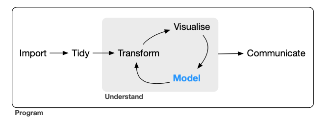
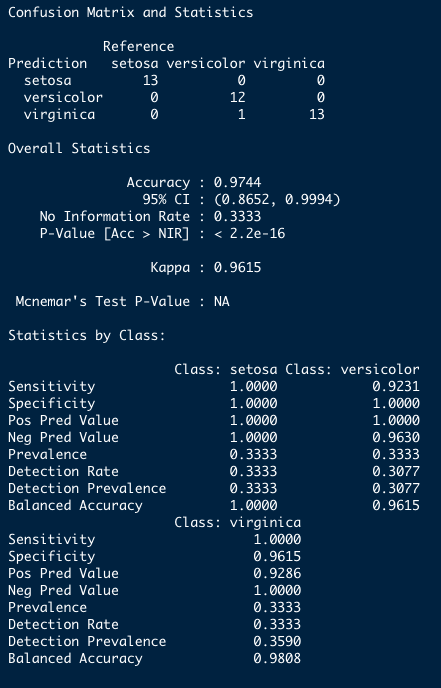
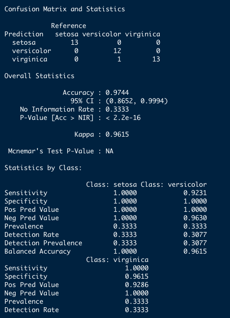
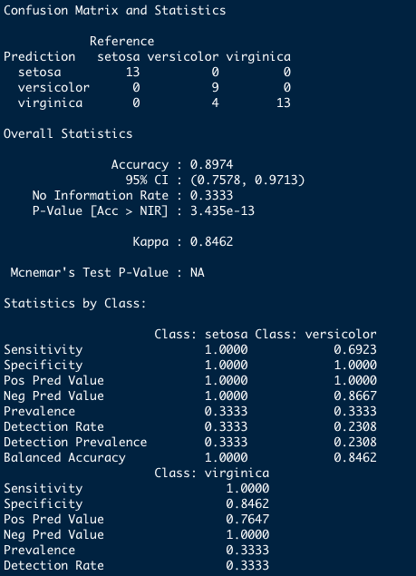

```{r xaringan-themer, include=FALSE, warning=FALSE}
# xaringan::summon_remark()
library("xaringanthemer")
style_duo_accent(
  primary_color = "#03A696",
  secondary_color = "#035AA6",
  header_font_google = google_font("Josefin Sans"),
  text_font_google   = google_font("Montserrat", "300", "300i"),
  code_font_google   = google_font("Fira Mono"),
  inverse_text_shadow = FALSE,
  outfile = "css/xaringan-themer.css")
```

```{r xaringanExtra, include=FALSE}
xaringanExtra::use_xaringan_extra(c("tile_view", "scribble"))
xaringanExtra::use_tachyons()
xaringanExtra::use_fit_screen()
xaringanExtra::use_panelset()
```

```{r load_pkgs, include=FALSE}
library("ggplot2")

library("tidymodels")
library("rsample")
library("recipes")
library("caret")

library("dplyr")
library("tibble")
library("magrittr")
library("data.table")
```

layout: false

name: title
class: left, bottom
background-image: url("figuras/title-slide.001.jpeg")
background-size: contain

.pull-left[

# .midlarge[.black[`r rmarkdown::metadata$title`]]

## .mid[.black[`r rmarkdown::metadata$subtitle`]]

#### .large[.black[`r rmarkdown::metadata$author` | `r rmarkdown::metadata$date`]]

]

<div class="cr cr-top cr-left cr-sticky cr-black">COVID19</div>

---

layout: true

<div class="cr cr-top cr-left cr-sticky cr-black">COVID19</div>

<a class="footer-link" href="https://github.com/ricoperdiz/oficina-dados-nir">Análise de dados NIR em R</a>

---

```{r, include=FALSE, eval=TRUE}
library("metathis")
meta() %>%
  meta_general(
    description = "Oficina para aprendizagem prática em ambiente R de ferramentas para manipular, pré-processar e analisar dados de espectroscopia no infravermelho próximo (NIR).",
    generator = "xaringan e remark.js"
  ) %>% 
  meta_name("github-repo" = "ricoperdiz/oficina-dados-nir") %>% 
  meta_social(
    title = "Oficina de análise de dados NIR em ambiente R - Partes 4—5 - LDA e PLS",
    url = "https://oficina-dados-nir-dia02.netlify.app",
    image = "https://raw.githubusercontent.com/ricoperdiz/oficina-dados-nir/main/02_dia2/share-card.png",
    image_alt = paste(
      "Slide título da oficina Análise de dados NIR em ambiente R:",
      "LDA e PLS,",
      "apresentado de forma privada a um grupo de estudantes no dia 2 de julho de 2021."
      ),
    og_type = "website",
    og_author = "Ricardo de Oliveira Perdiz",
    twitter_card_type = "summary_large_image",
    twitter_creator = "@ricoperdiz"
  )
```

# Sumário


### [Recapitulação](#recapitulacao) do primeiro dia

--

### Interface para análise de dados do [*caret*](#caret)

--

### Análise discriminante linear ([LDA](#lda))

--

### Análise de mínimos quadrados parciais ([PLS](#pls))

---
name: recapitulacao
# Recapitulação


.pull-left[



]

.pull-right[

#### Manipulação de dados utilizando o *dplyr*  

#### Preparação de dados pré-análise  

#### PCA  

]

.footnote2[

Figura de Wickham, H. e Grolemund, G. (2016) <http://r4ds.had.co.nz>.  

]


---
name: dados
# Importando dados para a oficina

.pull-left[
## Opção 1 - Dados `iris`

```{r}
dados <- iris
```


## Opção 2 - Importação de dados próprios

```{r, eval=FALSE}
library("data.table")
dados <- fread("MEUSDADOS.csv")
```
]


.pull-right[
## Opção 3 - Conjunto de dados `nir_data`<sup>1</sup>, que acompanha o pacote `NIRtools`<sup>2</sup>.  

```{r, eval=FALSE}
dados <-
  fread("https://raw.githubusercontent.com/ricoperdiz/NIRtools/master/inst/extdata/nir_data.csv")
```
]


---

## Transformação do `data.frame` em um `tibble`<sup>1</sup>

```{r}
library("tibble")
dados <- as_tibble(dados)
dados
```

.footnote2[

1. Este passo **NÃO É NECESSÁRIO**. Ele facilita apenas a visualização dos dados no console, e indica o tipo de cada variável em seu conjunto de dados. Saiba mais sobre um `tibble` em [https://r4ds.had.co.nz/tibbles.html](https://r4ds.had.co.nz/tibbles.html).  


]

---

## Atenção!!!

### Nova variável de nome de espécies

Em casos em que a variável contendo o nome da espécie apresente espaços, pontos `.` e/ou sinais diferentes, é necessário limparmos essa variável caso desejemos reter os valores de probabilidade atribuídos a cada espécie ao utilizarmos o *caret*.
Em casos assim, podemos tomar o procedimento abaixo:

```{r}
library("dplyr")
```


```{r, eval=FALSE}
dados$SP1 <- 
  case_when(
  dados$SP1 == "P. aracouchini" ~ "arac",
  dados$SP1 == "P. calanense" ~ "cala"
) %>% 
  as.factor(.)
```

---

# Pré-processamento dos dados

--

## Divisão dos dados em `treino` e `teste`

```{r}
library("rsample") # initial_split
dados_split <- initial_split(dados, strata = "Species")
treino <- training(dados_split)
teste <- testing(dados_split)
```

---
name: receita

## Criação e preparo da receita

```{r}
library("recipes")
treino_receita <- 
  recipes::recipe(Species ~ ., data = treino) %>% 
  prep()
treino_receita
```

---

# PCA

## I - PCA com todos os dados?

Primeiro, criamos uma receita indicando no argumento `data` o nome de nosso conjunto de dados.
Depois fazemos as devidas atualizações dos papéis das variáveis que não são nem preditoras nem resposta com a função `update_role()`.
Em seguida, executamos a PCA com a função `step_pca()` para todas as variáveis NIR, utilizando a função auxiliar `all_predictors()` para, por fim, prepararmos a receita com a função `prep()`.  

Depois, é só plotar os dados *espremendo* a receita, o que vai gerar uma PCA com os dados completos.  

---

## I - PCA com todos os dados?

```{r}
dados_completos_receita_pca_pre <- 
  recipes::recipe(Species ~ ., data = dados) %>% 
  step_normalize(all_predictors()) %>% 
  step_pca(all_predictors()) %>% 
  prep()
dados_completos_receita_pca_pre
```


---

## II - PCA com todos os dados?

```{r}
pca_tabela <- tidy(dados_completos_receita_pca_pre, 2)
pca_tabela
```

---

## III - PCA com todos os dados?

### Variação das PC's

```{r}
sdev_pca_normalizada <- dados_completos_receita_pca_pre$steps[[2]]$res$sdev
porcent_variacao_normalizada <- sdev_pca_normalizada^2 / sum(sdev_pca_normalizada^2)
pca_normalizada_variacao <- 
  data.frame(
    pcs = unique(pca_tabela$component),
    variacao_porcentagem = porcent_variacao_normalizada*100,
    variacao_cumulativa = cumsum(porcent_variacao_normalizada*100)
  )
pca_normalizada_variacao
```

---

## IV - PCA com todos os dados?

.pull-left[

### Plotando PCA com dados completos

```{r, eval=FALSE, echo=TRUE}
library("ggplot2")
pc1 <- filter(pca_normalizada_variacao, pcs == "PC1")
pc2 <- filter(pca_normalizada_variacao, pcs == "PC2")
juice(dados_completos_receita_pca_pre) %>%
  ggplot(aes(PC1, PC2)) +
  geom_point(aes(color = Species), alpha = 0.7, size = 2) +
  xlab(paste0("PC1 (", round(pc1$variacao_porcentagem, 2), "%)")) +
  ylab(paste0("PC2 (", round(pc2$variacao_porcentagem, 2), "%)"))
```
]

.pull-right[

```{r, eval=T, echo=F, fig.width=9, fig.height=7}
library("ggplot2")
pc1 <- filter(pca_normalizada_variacao, pcs == "PC1")
pc2 <- filter(pca_normalizada_variacao, pcs == "PC2")
juice(dados_completos_receita_pca_pre) %>%
  ggplot(aes(PC1, PC2)) +
  geom_point(aes(color = Species), alpha = 0.7, size = 2) +
  xlab(paste0("PC1 (", round(pc1$variacao_porcentagem, 2), "%)")) +
  ylab(paste0("PC2 (", round(pc2$variacao_porcentagem, 2), "%)"))
```

]


---

class: center, middle

# Pacote __caret__ - **C**lassification **A**nd **RE**gression **T**raining (Kuhn 2021)


---
name: caret

## Interface para análise de dados do *caret*

#### O pacote contem funções para simplificar tanto o treinamento de modelos para regressões e análises de classificação como a avaliação da efetividade dos modelos gerados.  

--

#### **Fluxo de processamento e análise de dados**  

--

Duas funções básicas:

```
caret::train()
caret::trainControl()
```

---

## Fluxograma de um perfil básico de análise

.center2[
```{r diagrama, echo=FALSE, cache=FALSE, dev='png'}
# fig.height=7, fig.width=12, 
library("DiagrammeR")
grViz("
digraph fluxograma_modelagem {

# a 'graph' statement
  graph [overlap = true, fontname = Helvetica, fontsize = 150]

# node definitions
node [shape = box]

a [label = '@@1']
b [label = '@@2']
e [label = '@@5']
f [label = '@@6']
j [label = '@@10']
k [label = '@@11']

node [shape = circle]

c [label = '@@3']
d [label = '@@4']
g [label = '@@7']
h [label = '@@8']
i [label = '@@9']

# edge definitions with the node IDs
a -> b
b -> c
b -> d
a -> e
c -> e
e -> f
e -> g
f -> h
f -> i
{a c} -> f
g -> h
{h i} -> j
j -> k
d -> j
}

[1]: 'Dados' # a
[2]: 'Quebra dos dados \\n rsample::initial_split()'
[3]: 'Treino' # c
[4]: 'Teste' # d
[5]: 'Receita  \\n recipes::recipe()' # e
[6]: 'Interface caret \\n train()' # f
[7]: 'PCA' # g
[8]: 'LDA' # h
[9]: 'PLS-DA' # i
[10]: 'Predições' # j
[11]: 'Avaliação \\n performance' # k
",
  engine = "dot")

```

]


---
name: lda

# Análise discriminante linear (LDA)

Método de redução de dimensões ao mesmo tempo em que se retem o máximo de informação possível.
O método ajuda a achar a combinação linear das variáveis originais que providenciam a melhor separação entre os grupos.<sup>1</sup>  

--

> Maximiza a medida inter-classes e minimiza a medida intra-classes.  

--

__Utilizada quando a variável *dependente* é *categórica*, e as variáveis *independentes* são *quantitativas*.__  

--

Em R, utilizamos a função `lda()` do pacote `MASS` (Venables e Ripley 2002)<sup>2</sup>.

--

Usando o `caret`, a função é a mesma, porém dentro de uma interface comum a vários métodos diferentes<sup>3</sup>.  

```{r}
library("MASS")
```


.footnote2[

1. Fávero, L. P., Belfiore, P., Silva, F. L. e Chan, B.L. (2009) Análise de dados: Modelagem multivariada para tomada de decisões. Rio de Janeiro: Elsevier.  

2. Venables, W. N. e Ripley, B. D. (2002) Modern Applied Statistics with S. Fourth Edition.  

3. Lista completa de modelos aceitos no caret: <https://topepo.github.io/caret/available-models.html>.  

]

---

## Premissas<sup>1</sup>

* *Normalidade multivariada*  
* *Homogeneidade de variância/covariância*  
* *Independência entre as observações*  


--

*Multicolinearidade* pode diminuir o poder preditivo da classificação pois viola a independência das observações. 

.footnote[

1. Fávero, L. P., Belfiore, P., Silva, F. L. e Chan, B.L. (2009) Análise de dados: Modelagem multivariada para tomada de decisões. Rio de Janeiro: Elsevier.  

]

---


## Um exemplo - I - Execução

Receita criada no slide [Criação da receita](#receita).  

.pull-left[

```{r}
library("caret")
```


]

.pull-right[

```{r, eval=FALSE}
ldafit_cvsimples <-
  train(
    treino_receita, treino,
    method = "lda",
    metric = "Accuracy"
  )
```

]

---

### Checagem de resultados

```{r, include=FALSE}
load("ldafit_cvsimples.RData")
```

```{r}
ldafit_cvsimples
```

---

### Um exemplo - II - Medindo performance do `treino`

```{r}
getTrainPerf(ldafit_cvsimples)
```

---

### Um exemplo - III - Predições e performance em `teste`

.pull-left[
```{r}
predicao_lda_basico <- 
  ldafit_cvsimples %>%
  predict(., newdata = teste)
predicao_lda_basico
```
]

---

### Um exemplo - III - Predições e performance em `teste`

.panelset.sideways[
.panel[.panel-name[Código]

```{r, eval=F, echo=T}
confusionMatrix(data = predicao_lda_basico, reference = teste$Species)
```
]
.panel[.panel-name[Resultado]



]

]

.footnote2[

Para entender métricas de performance: <https://topepo.github.io/caret/measuring-performance.html#class>.  

]

---

### Um exemplo - IV - Matriz de confusão

.pull-left[
Função `confusao_lab()` do pacote `NIRtools`<sup>1</sup>.
Caso não consigam ou não desejem instalar o pacote, basta fazer um `source()`:

```{r, cache=TRUE}
source("https://raw.githubusercontent.com/ricoperdiz/NIRtools/master/R/confusion_matrix.R")
```


```{r, eval=FALSE}
par(mar = c(1, 5, 5, 1))
table(teste$Species, predicao_lda_basico) %>% 
  confusao_lab(.)
```
]

.pull-right[
```{r, eval=TRUE, echo=FALSE}
par(mar = c(1, 5, 5, 1))
table(teste$Species, predicao_lda_basico) %>% 
  NIRtools::confusao_lab(.)
```
]

.footnote2[

1. Perdiz (2021) <https://github.com/ricoperdiz/NIRtools> 

]

---

## Argumentos<sup>1</sup> para criação de modelos com a função `trainControl()`

* `method`: _boot_, _cv_, _LOOCV_, _LGOCV_, _repeatedcv_ e _none_ (há mais opções!)
* `number` e `repeats`: primeiro controla o número de divisões em _cv/repeatedcv_ OU número de iterações para _bootstrap_ e _LOOCV_; segundo se aplica somente ao k-fold. 
* `verboseIter`: Mostra um log
* `returnData`: Retorna os dados que servem de entrada?
* `p`: Porcentagem em _LGOCV_
* `classProbs`: valor lógico para determinar se as probabilidades de atribuição a cada classe devem ser calculadas
* `returnResamp`: _all_, _final_ or _none_
* `allowParallel`: Paraleliza?


.footnote2[

1. Para uma lista completa, acesse a ajuda da função: `?trainControl`

]

---
name: ctrl-cv

## Prática com `trainControl()`

### Validação cruzada *simples* - `cv`

```{r}
ctrl_cv <- 
  trainControl(method = "cv",
               number = 10, # faz uma validacao 10-fold
               verboseIter = FALSE,
               returnData = TRUE, # Nao importante! Pode ser falso
               classProbs = TRUE,
               savePredictions = "all")
```

```{r, eval=FALSE}
ldafit_cv_10fold <- 
  train(
    treino_receita, treino,
    method = "lda",
    trControl = ctrl_cv,
    metric = "Accuracy" # em classificacoes, dois valores sao possiveis: Accuracy ou Kappa
  )
```

---

#### Acessando o resultado de `train()` - I

```{r, include=FALSE}
# save(ldafit_cv_10fold, file = "ldafit_cv_10fold.RData")
load("ldafit_cv_10fold.RData")
```

```{r}
names(ldafit_cv_10fold)
```

Para acessar as informações, basta executar um dos comandos abaixo:

.pull-left[
```{r, eval=FALSE}
ldafit_cv_10fold$method # metodo utilizado 
ldafit_cv_10fold$modelInfo # info do modelo
ldafit_cv_10fold$modelType # tipo de modelo
ldafit_cv_10fold$bestTune
ldafit_cv_10fold$call # formula utilizada em train()
ldafit_cv_10fold$dots # se verbose == TRUE ou FALSE
ldafit_cv_10fold$resample # estatisticas em cada reamostragem
ldafit_cv_10fold$metric # qual metrica utilizada em train()
ldafit_cv_10fold$control # especificacoes de trainControl()
```
]

---

#### Acessando o resultado de `train()` - II - Predições

```{r}
ldafit_cv_10fold$pred %>% 
  filter(obs != pred)
```

---

#### Acessando o resultado de `train()` - IV - resultados

.center[
```{r}
ldafit_cv_10fold$results
```
]

---

#### Acessando o resultado de `train()` - V - Modelo final


Resultado da LDA, caso fizéssemos uso da função `lda()`, referente ao modelo final: 

```{r}
ldafit_cv_10fold$finalModel
```

---

#### Medindo performance do `treino`

```{r}
getTrainPerf(ldafit_cv_10fold)
```

---

#### Predições e performance em `teste`

.panelset.sideways[
.panel[.panel-name[Código]

```{r, eval=F, echo=T}
predicao_lda_cv_10fold <- 
  ldafit_cv_10fold %>%
  predict(., newdata = teste)
confusionMatrix(data = predicao_lda_cv_10fold, reference = teste$Species)
```

]

.panel[.panel-name[Resultado]



]

]

---

#### Matriz de confusão


.pull-left[
Função `confusao_lab()` do pacote `NIRtools`<sup>1</sup>.  

```{r, eval=FALSE}
par(mar = c(1, 5, 5, 1))
table(teste$Species, predicao_lda_basico) %>% 
  NIRtools::confusao_lab(., add_CP = TRUE)
```
]

.pull-right[

```{r, echo=FALSE}
par(mar = c(1, 5, 5, 1))
table(teste$Species, predicao_lda_basico) %>% 
  NIRtools::confusao_lab(., add_CP = TRUE)
```
]

.footnote2[

1. Perdiz (2021) <https://github.com/ricoperdiz/NIRtools> 

]


---

### Validação cruzada *repetida* - `repeatedcv`

.pull-left[

```{r}
ctrl_lda_repeatedcv <-
  trainControl(
    method = "repeatedcv",
    number = 10, # faz uma validacao 10-fold
    repeats = 10,
    verboseIter = FALSE,
    returnData = FALSE, # Nao importante! Pode ser falso
    classProbs = TRUE,
    savePredictions = "all"
  )
```

]

.pull-right[

```{r, eval=FALSE}
ldafit_repeatedcv_10fold_10vezes <- 
  train(
    treino_receita, treino,
    method = "lda",
    trControl = ctrl_lda_repeatedcv,
    metric = "Accuracy" # em classificacoes, dois valores sao possiveis: Accuracy ou Kappa
  )
```

]

```{r, include=FALSE}
# save(ldafit_repeatedcv_10fold_10vezes, file = "ldafit_repeatedcv_10fold_10vezes.RData")
# load("ldafit_repeatedcv_10fold_10vezes.RData")
```


---

## Receitas de pré-processamento e o *caret*

### Por que aprender isso?

--

#### Mais possibilidades no pré-processamento dos dados  

#### Manter variáveis adicionais para medir performance  


---

## E o caret sem receita, pode?

--

### **Pode!**

```{r, include=FALSE}
# save(resultado_lda_sem_receita_basico, file = "resultado_lda_sem_receita_basico.RData")
load("resultado_lda_sem_receita_basico.RData")
```

.pull-left[

#### Execução

```{r, eval=FALSE}
resultado_lda_sem_receita_basico <-
  train(
    Species ~ .,
    data = treino,
    method = "lda",
    metric = "Accuracy"
  )
```

]

.pull-right[

#### Checagem de resultado

```{r}
print(resultado_lda_sem_receita_basico)
```

]

---

#### Medindo performance do `treino`

```{r}
getTrainPerf(resultado_lda_sem_receita_basico)
```

---

#### Predições e performance em `teste`

.center[
```{r, echo=TRUE, eval=TRUE}
predicao_lda_sem_receita_basico <- 
  resultado_lda_sem_receita_basico %>%
  predict(., newdata = teste)

confusionMatrix(data = predicao_lda_sem_receita_basico, reference = teste$Species)
```

]

---

#### Matriz de confusão

.pull-left[
Função `confusao_lab()` do pacote `NIRtools`<sup>1</sup>.  

```{r, eval=FALSE}
par(mar = c(1, 5, 5, 1))
table(teste$Species, predicao_lda_sem_receita_basico) %>% 
  NIRtools::confusao_lab(.)
```
]

.pull-right[
```{r, eval=TRUE, echo=FALSE}
par(mar = c(1, 5, 5, 1))
table(teste$Species, predicao_lda_sem_receita_basico) %>% 
  NIRtools::confusao_lab(.)
```
]


.footnote2[

1. Perdiz (2021) <https://github.com/ricoperdiz/NIRtools> 

]

---
name: pls

# Análise de mínimos quadrados parciais (PLS)

Método muito utilizado na quimiometria, especialmente quando o número de variáveis preditoras é significantemente maior que o número de observações.  

--

Baseia-se em variáveis latentes, em que cada fator é definido como uma combinação linear das variáveis originais das variáveis preditoras ou variável resposta.  

--

> Essencialmente, trata-se de uma versão *supervisionada* da PCA<sup>1</sup>

```{r}
library("pls")
```


.footnote2[

1. Kuhn (2021) <https://topepo.github.io/caret/using-your-own-model-in-train.html#illustrative-example-4-pls-feature-extraction-pre-processing>.  
]

---
name: pls-cv

## **PLS** com o pacote `caret`

--

### Dados

Mesmo conjunto de dados utilizado anteriormente.
Coloco aqui para facilitar a preparação dos dados para a PLS.  

```{r}
dados <- iris
dados <- as_tibble(dados)
dados_split <- initial_split(dados, strata = "Species")
treino <- training(dados_split)
teste <- testing(dados_split)
treino_receita <- 
  recipes::recipe(Species ~ ., data = treino) %>% 
  prep()
```

---

### Execução

.pull-left[
```{r}
ctrl_exemplo_pls <-
  trainControl(
    method = "repeatedcv",
    number = 10,
    repeats = 10,
    verboseIter = FALSE,
    savePredictions = "final")
```
]

.pull-right[

```{r, eval=FALSE}
plsfit_exemplo <-
  train(
    treino_receita, treino,
    method = "pls",
    metric = "Accuracy",
    trControl = ctrl_exemplo_pls,
    tuneLength = 3
  )
```
]

```{r, include=FALSE}
## Paralelização do código
# library("parallel")
# library("doParallel")
# no_cores <- parallel::detectCores() - 1
# cl <- makePSOCKcluster(no_cores)
# registerDoParallel(cl)
```


???

É importante comentar sobre a utilidade do argumento `tuneGrid` da função `train()` quando executamos uma PLS.  

Também comentar sobre a possibilidade de paralelização da análise por meio do pacote `paralell` e a função `registerDoParallel`.  

---

### Checando o resultado

```{r, include=FALSE}
# save(plsfit_exemplo, file = "plsfit_exemplo.RData")
load("plsfit_exemplo.RData")
```

```{r}
plsfit_exemplo
```

---

### Acurácia por número de componentes

```{r}
plot(plsfit_exemplo)
```

---

### Predições e performance

```{r}
plsfit_exemplo %>%
  predict(newdata = teste) %>% 
  confusionMatrix(data = ., reference = teste$Species)
```

---

## Validação cruzada *Leave-one-out* - `LOOCV`

.pull-left[
```{r}
ctrl_loocv <-
  trainControl(
    method = "LOOCV",
    verboseIter = FALSE,
    savePredictions = "final")
```
]

.pull-right[
```{r, eval=FALSE}
plsfit_exemplo_loocv <-
  train(
    treino_receita, treino,
    method = "pls",
    metric = "Accuracy",
    trControl = ctrl_loocv,
    tuneGrid = expand.grid(ncomp = 2)
  )
```
]

```{r, include=FALSE}
# save(plsfit_exemplo_loocv, file = "plsfit_exemplo_loocv.RData")
load("plsfit_exemplo_loocv.RData")
```


---

### Checagem de resultado

```{r}
plsfit_exemplo_loocv
```


---

### Medindo performance do `treino`

```{r}
getTrainPerf(plsfit_exemplo_loocv)
```

---

### Predições e performance em `teste`

.panelset.sideways[
.panel[.panel-name[Código]

```{r, echo=TRUE}
predicao_plsfit_exemplo_loocv <- 
  plsfit_exemplo_loocv %>%
  predict(., newdata = teste)
confusionMatrix(data = predicao_plsfit_exemplo_loocv, reference = teste$Species)
```
]

.panel[.panel-name[Resultado]



]
]

---

### Matriz de confusão

.pull-left[
Função `confusao_lab()` do pacote `NIRtools`<sup>1</sup>.  

```{r, eval=FALSE}
par(mar = c(1, 5, 5, 1))
table(teste$Species, predicao_plsfit_exemplo_loocv) %>% 
  NIRtools::confusao_lab(.)
```
]

.pull-right[
```{r, eval=TRUE, echo=FALSE}
par(mar = c(1, 5, 5, 1))
table(teste$Species, predicao_plsfit_exemplo_loocv) %>% 
  NIRtools::confusao_lab(., add_CP = TRUE)
```
]

.footnote2[

1. Perdiz (2021) <https://github.com/ricoperdiz/NIRtools> 

]

---

# Resumo de construção e avaliação de modelos com a interface *caret*

* `trainControl()` e `train()` - controla argumentos e treina modelos
* `getTrainPerf()` avalia o modelo com dados `treino`
* `predict()` para predizer categoria das amostras em `teste`
* `confusionMatrix()` para obter métricas de performance e matriz de confusão
* `confusao_lab` para plotar uma matriz de confusão no estilo LABOTAM.  

---
class: top
background-image: url("figuras/agradecimento.jpeg")
background-size: cover

### Grato!


.pull-right[


[`r icons::fontawesome("github")` @ricoperdiz](https://github.com/ricoperdiz)  
[`r icons::fontawesome("twitter")` @ricoperdiz](https://twitter.com/ricoperdiz)  
[`r icons::fontawesome("link")` ricardoperdiz.com](https://ricardoperdiz.com)  
[`r icons::fontawesome("paper-plane")` ricoperdiz@gmail.com](mailto:ricoperdiz@gmail.com)
]

---

# Info do sistema

```{r, echo=FALSE}
sessionInfo()
```

